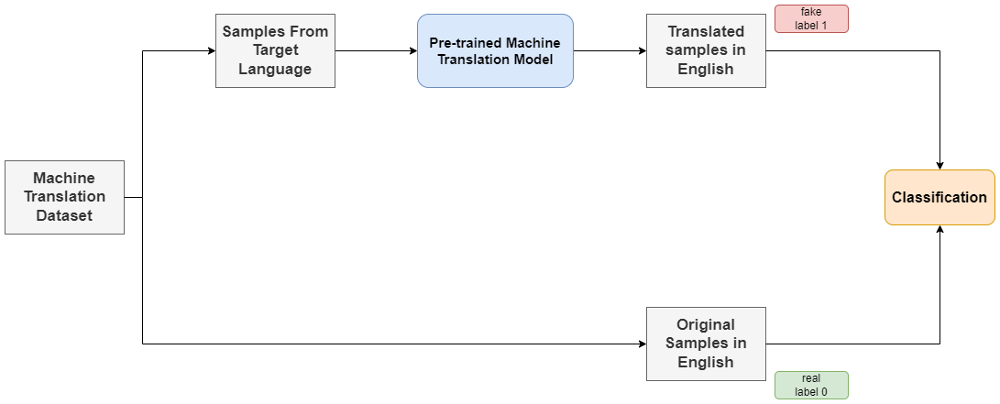

# Synthetic Text Identification

This is the final project of course CSE472(Machine Leanring Sessional). It was done by
- [Sheikh Saifur Rahman](https://github.com/Srj)
- [Zaber Ibn Abdul Hakim](https://github.com/zaber666)

In recent times, ChatGPT has taken the world by storm. It has been also seen to be used in writing assignments, papers, essays etc. which was supposed to be an indicator of an individual's capability. That's why it has become important to be able to trace the footprints left by a model while generating a text. In this project, we tried to come to a conclusion, if there is any such footprint and if it is detectable by a model.

The pipeline of our procedure is like below:

We used the following datasets for generating samples,
- French to English Translation Dataset. [Link](https://www.kaggle.com/datasets/dhruvildave/en-fr-translation-dataset)
- German to English Transation Dataset. [English](https://nlp.stanford.edu/projects/nmt/data/wmt14.en-de/train.en) [German](https://nlp.stanford.edu/projects/nmt/data/wmt14.en-de/train.de)
- Czech to English Translation Dataset. [English](https://nlp.stanford.edu/projects/nmt/data/wmt15.en-cs/train.en) [Czezh](https://nlp.stanford.edu/projects/nmt/data/wmt15.en-cs/train.cs)

### Classification Performance
| Model                | AUC on Train | AUC on Validation |
| :---------------------- | :--------: | :---------: | 
| distilbert-base-uncased     |    81.6    |    78.3     | 